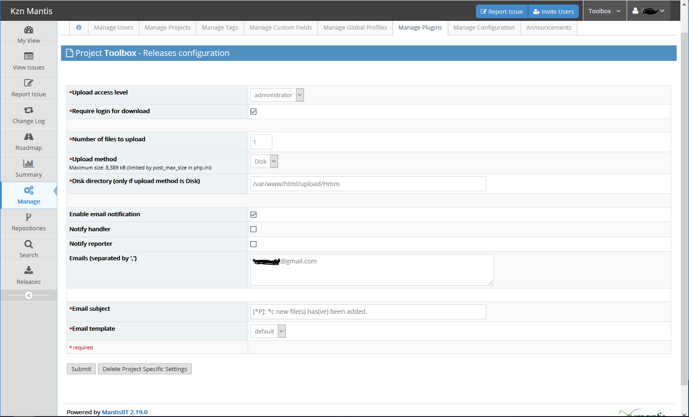
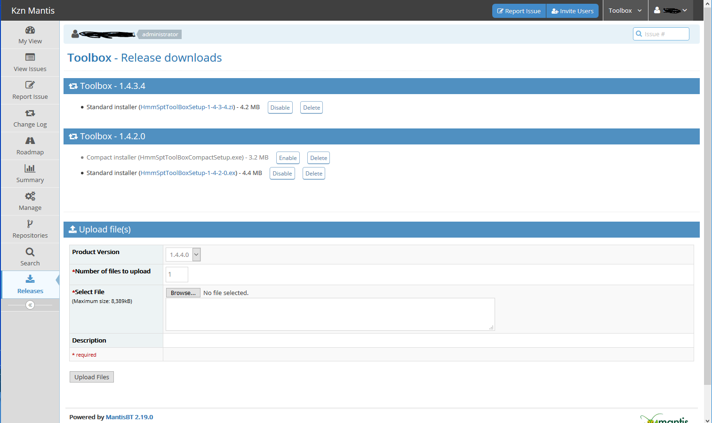
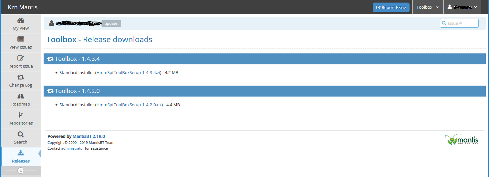

# Release Management Plugin

## Description

This plugin allows user to store the files to download for each release. An
email is sent to the developer during the file upload.

## Features:

  - Email notification (to developer and/or user who reports a bug)
  - Email templates
  - Easy to install.

## Requirements

  - MantisBT 2.x
  
## Tested 

  - MantisBT 2.19.0

## Screenshots

### Plugin configuration screen

### Project releases screen for the user with upload access

User can:
1. Upload files. Change number of files to upload when you need more then one file for the same release
2. Delete any file
3. Disable file (new in version 2.0). When file disabled it will be not shown to a regular user

### Project releases screen for the user without upload access rights

User can only see and download enabled files

## Authors and original code

  - Vincent Debout <deboutv@free.fr>
    http://deboutv.free.fr/mantis/plugin.php?plugin=ReleaseMgt
  - Jiri Hron <jirka.hron@gmail.com>
    http://code.google.com/p/mantis-releasemgt/
    
